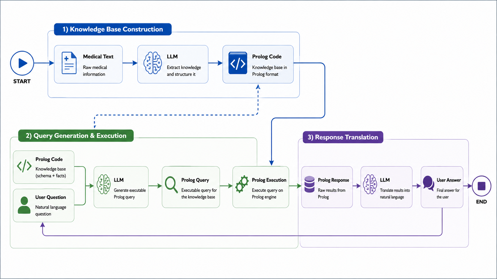
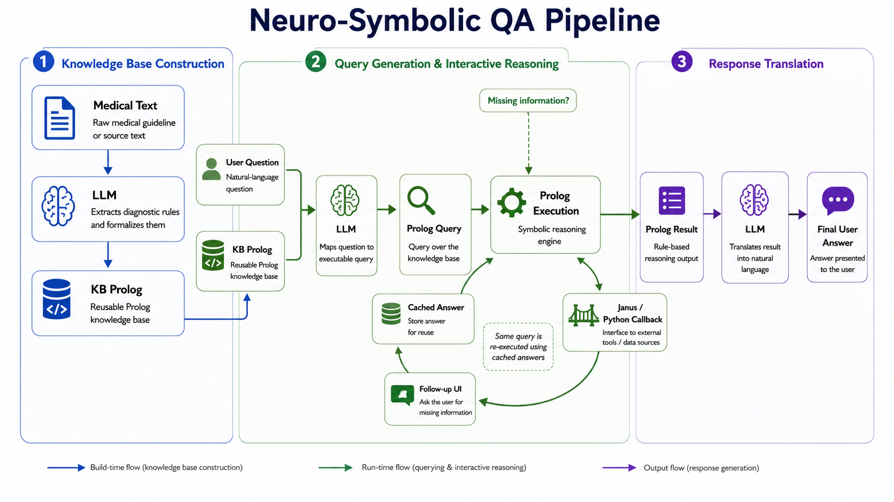
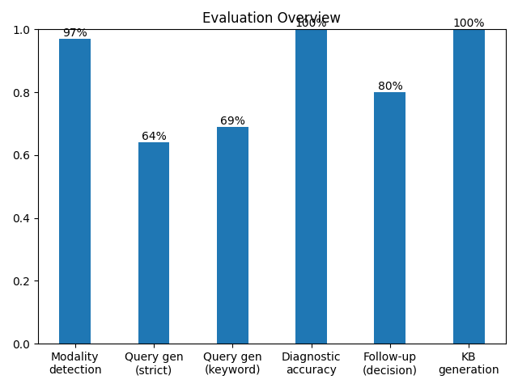
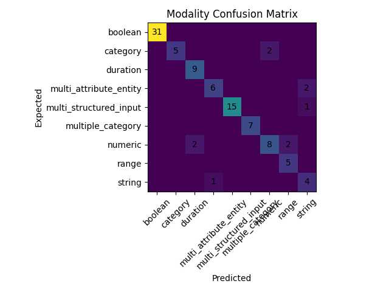
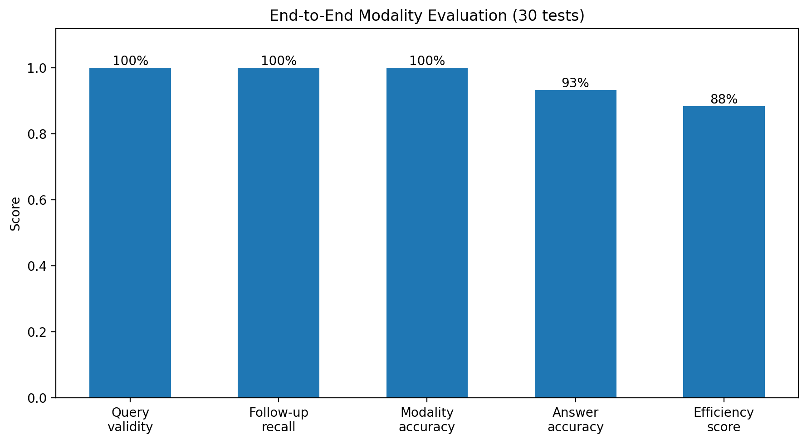
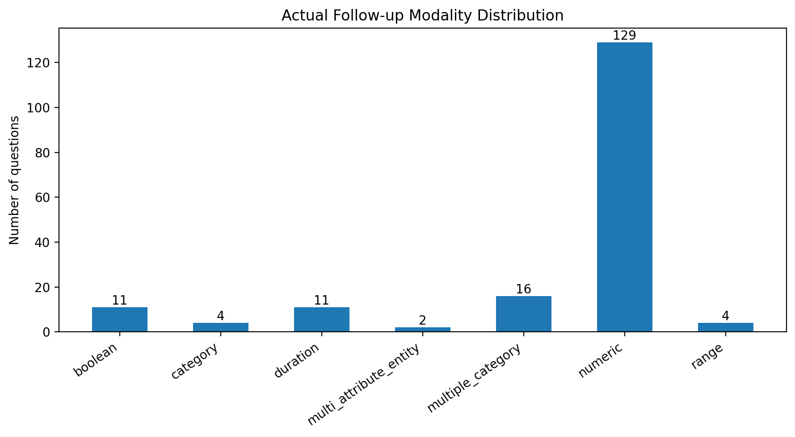
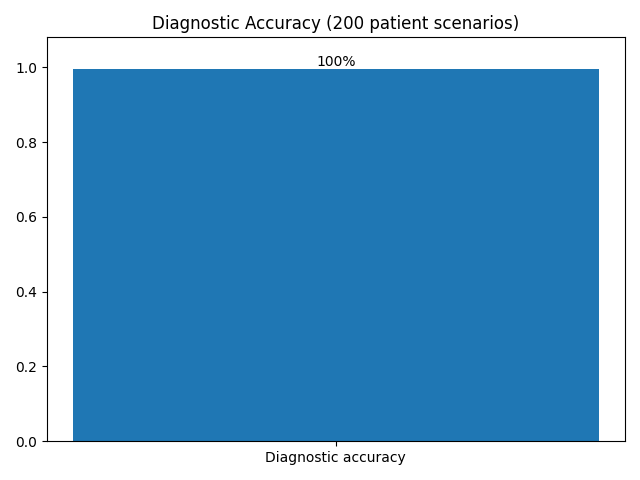
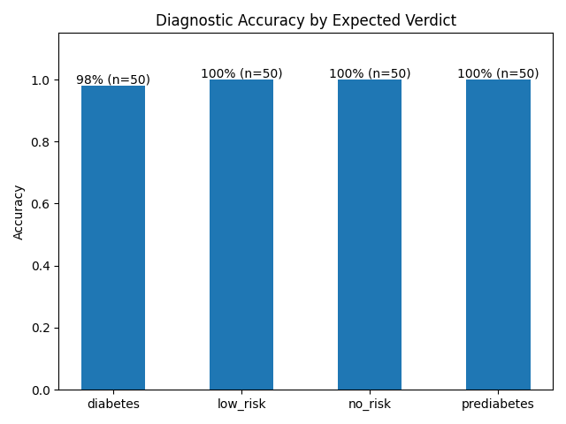

# NeuroSymbolic Diabetes Diagnosis Assistant

A neurosymbolic medical question-answering system that combines Large Language
Model (LLM) reasoning with symbolic Prolog inference to hold an interactive,
multi-modal diagnostic dialogue and reach a verifiable, rule-grounded verdict.

> **Abstract**: A user asks a medical question in natural language. An LLM
> converts unstructured medical text into a symbolic Prolog knowledge base
> once, and converts the user's question into a Prolog query on every turn.
> SWI-Prolog then reasons over the KB, interactively asking the user for any
> missing clinical facts through the correct input widget, yes/no, a
> number, a dropdown, a slider, a multi-select checklist, a
> sequence/ranking/grouping input, or a multi-field entity form. Once enough
> evidence is gathered, Prolog reaches a deterministic, explainable verdict,
> which an LLM translates back into plain language. Every pipeline stage is
> independently, quantitatively evaluated, including a full, live
> end-to-end run of the real interactive dialogue, not just its isolated
> components.
> 

## Project Overview

The project separates language processing from symbolic reasoning:

- **The language model** converts source text into Prolog rules, maps
  natural-language questions to Prolog queries, classifies expected answer
  formats, and translates technical results into readable text.
- **SWI-Prolog** applies the generated rules and determines which information
  is still required.
- **Janus** connects Prolog with Python through `py_call`.
- **Python** manages application state, cached answers, and communication
  between Prolog and the user interface.
- **Streamlit** renders the chat interface and the input widget required for
  each follow-up question.

## Table of Contents

1. [Repository Structure](#1-repository-structure)
2. [`app.py` / `main.py` / `config.py` / `prolog_bridge.py`](#2-apppy--mainpy--configpy--prolog_bridgepy)
3. [`data/snippets/`](#3-datasnippets)
4. [`prolog/generated_kb/`](#4-prologgenerated_kb)
5. [`llm/`: the five LLM touchpoints](#5-llm-the-five-llm-touchpoints)
6. [`services/`: orchestration layer](#6-services-orchestration-layer)
7. [`dialogue/`: conversational memory](#7-dialogue-conversational-memory)
8. [`ui/`: the Streamlit interface](#8-ui-the-streamlit-interface)
9. [`modalities/`: legacy CLI handlers](#9-modalities-legacy-cli-handlers)
10. [`evaluation/`: two structurally separate groups](#10-evaluation-two-structurally-separate-groups)
    - [Unit Tests](#101-evaluationtests--evaluationtesting_suite--evaluationresults-unit-tests)
    - [Behavioral Evaluators](#102-evaluationbehavioral_evaluators-behavioral-evaluators)
11. [Motivation](#11-motivation)
12. [Goals](#12-goals)
13. [The Neurosymbolic Design & Prolog ⇄ Python Integration](#13-the-neurosymbolic-design--prolog--python-integration)
    - [System Architecture Overview](#131-system-architecture-overview)
    - [Interactive Reasoning Pipeline](#132-interactive-reasoning-pipeline)
    - [Janus Callback Implementation](#133-janus-callback-implementation)
14. [The Diabetes Domain](#14-the-diabetes-domain)
15. [Input Modalities](#15-input-modalities)
16. [End-to-End Diagnostic Workflow Example](#16-end-to-end-diagnostic-workflow-example)
17. [Setup & Installation](#17-setup--installation)
18. [Usage](#18-usage)
    - [Run the Interactive Web Application](#181-run-the-interactive-web-application)
    - [Use the Application](#182-use-the-application)
19. [Evaluation Results](#19-evaluation-results)
    - [Unit tests (one component at a time)](#191-unit-tests-one-component-at-a-time)
    - [Behavioral evaluators (live, chained system)](#192-behavioral-evaluators-live-chained-system)
    - [Diagnostic accuracy](#193-diagnostic-accuracy)
20. [Engineering Lessons Learned](#20-engineering-lessons-learned)
21. [Known Limitations](#21-known-limitations)
22. [Future Work](#22-future-work)

---

## 1. Repository Structure

```
input_modalities/
├── app.py                       # Streamlit entry point
├── main.py                      # Legacy single-shot CLI entry point
├── config.py                    # Loads OPENAI_API_KEY / model name from .env
├── prolog_bridge.py             # Python-side ask_* callbacks for Prolog
├── requirements.txt
│
├── data/
│   └── snippets/                # 6 source medical texts (one KB generated per file)
│
├── prolog/
│   └── generated_kb/            # LLM-generated Prolog KBs, one per snippet,
│                                 #   plus evaluation_kb.pl used only by evaluation
│
├── llm/                         # The five LLM touchpoints
│   ├── client.py
│   ├── kb_generator.py
│   ├── query_generator.py
│   ├── response_translator.py
│   ├── modality_detector.py
│   └── followup_generator.py
│
├── services/                    # Orchestration layer
│   ├── pipeline.py
│   ├── interaction_service.py
│   ├── session_service.py
│   ├── kb_service.py             # currently unused, see below
│   └── rag_service.py            # currently unused, see below
│
├── dialogue/                    # Conversational memory
│   ├── session_handler.py
│   ├── state_manager.py
│   ├── context_tracker.py
│   ├── followup_manager.py
│   └── modality_handler.py
│
├── ui/                           # Streamlit interface
│   ├── pages/chat.py
│   ├── components/{sidebar,history_panel,chat_window,message,loading_spinner,source_cards}.py
│   └── styles/{theme,css}.py
│
├── modalities/                   # Legacy CLI input handlers used only by main.py
│
└── evaluation/                   # Two structurally separate evaluation groups
    ├── tests/                    # UNIT TESTS: one script per isolated component
    │   └── json_entries/          #   their fixtures
    ├── testing_suite/            # UNIT TESTS: orchestration (benchmark/metrics/plots)
    ├── results/                   # UNIT TESTS: results + plots
    │
    └── behavioral_evaluators/    # BEHAVIORAL EVALUATORS: live, chained dialogue tests
        ├── modalities_evaluator.py
        ├── legacy_handler_evaluator.py
        ├── plot_modalities_evaluator.py
        ├── json_entries/          #   their fixtures
        └── results/                #   their results + plots
```

The rest of this README walks through each of these in order, then covers
setup, usage, evaluation results, engineering lessons, and known limitations.

---

## 2. `app.py` / `main.py` / `config.py` / `prolog_bridge.py`

- **`app.py`** : the Streamlit entry point. It does almost nothing itself: it
  calls `render_chat()` from `ui/pages/chat.py`. All real application
  behavior lives inside that module instead, so the entry point stays a
  one-line launcher no matter how much the UI grows.
- **`main.py`** : the original, pre-Streamlit, single-shot CLI script this
  project grew out of. Kept working as a legacy path and a useful sanity
  check: if it still produces a correct diagnosis, the reasoning engine
  underneath the UI hasn't broken.
- **`config.py`** : loads `OPENAI_API_KEY` and the model name (`gpt-5-mini`)
  from `.env`, so no other module reads environment variables directly.
- **`prolog_bridge.py`** : the Python side of every `ask_boolean`/`ask_numeric`/…
  callback a generated Prolog file invokes. Each one checks a per-session
  answer cache first; if the question hasn't been answered yet, it registers
  the question (with its full modality and options) and raises
  `WaitingForUserInput`, which the UI turns into the right widget. Getting
  this file right is what makes a real multi-turn conversation possible,
  rather than only ever answering one fully-specified query.

## 3. `data/snippets/`

Six deliberately distinct medical texts, so KB generation can be tested for
genuine generalization rather than memorization of one document:

| File | Domain | Notable emphasis |
|---|---|---|
| `diabetes.txt` | General/adult overview | Balanced mix of all modalities |
| `diabetes_type1_pediatric.txt` | Type 1, pediatric | Acute onset, DKA warning signs |
| `diabetes_gestational.txt` | Gestational | Pregnancy screening protocol |
| `diabetes_type2_lifestyle.txt` | Type 2, lifestyle | Casual tone, BMI/activity/diet factors |
| `diabetes_elderly_polypharmacy.txt` | Elderly, polypharmacy | HbA1c-unreliable-in-CKD caveats, medications that can raise glucose |
| `diabetes_german_source.txt` | General, **written entirely in German** | Tests generalization across language, not just tone |

New texts can be added at runtime through the UI's "Add new medical text"
panel, no code changes required.

## 4. `prolog/generated_kb/`

Nothing here is hand-written for the live app. Every `.pl` file is produced
at runtime by `llm/kb_generator.py` from the matching text in
`data/snippets/`; `pipeline.py` now reuses a KB file already on disk rather
than regenerating it on every launch (delete the file to force a fresh
generation). `evaluation_kb.pl` is the exception, it's written and consulted
only by `evaluation/behavioral_evaluators/modalities_evaluator.py`, kept
separate from the app's own per-snippet KBs.

## 5. `llm/`: the five LLM touchpoints

Every module here is deliberately narrow-scoped, so the model's freedom
never leaks into the diagnostic decision itself:

- **`client.py`** : one shared OpenAI client.
- **`kb_generator.py`** : converts medical text into a Prolog file. The
  prompt encodes several hard constraints learned from real failures: Janus
  can only safely convert atoms/numbers/strings/lists/dicts back to Python,
  so custom compound terms are forbidden; criterion predicates must gather
  everything they need themselves rather than expecting arguments; boolean
  results must come back as the Prolog atoms `true`/`false`, not raw Python
  booleans.
- **`query_generator.py`** : turns a question into a Prolog query, choosing
  between the main workflow predicate, a direct status check, or a specific
  criterion predicate depending on phrasing.
- **`response_translator.py`** : turns a Prolog result into natural language.
- **`modality_detector.py`** : classifies a question's expected input type
  across all nine supported modalities.
- **`followup_generator.py`** : a deliberately deterministic, keyword-based
  (not LLM-driven) suggester for a complementary follow-up question.

All five prompts are written **without domain-specific examples**, 
no hardcoded predicate names, symptom lists, or sample values, only abstract
placeholder-based templates, a specific requirement so the same prompts
generalize across arbitrary medical texts rather than anchoring to the
vocabulary of whichever text they were developed against.

## 6. `services/`: orchestration layer

- **`pipeline.py`** : the heart of the app. Its `ask()`/`resume()` methods
  implement *resume-by-recompute*: since a Prolog query can't be paused
  mid-execution, answering one question actually re-runs the whole query
  from scratch, relying on an answer cache so already-answered questions
  resolve instantly. It also builds/consults a KB per snippet (reusing an
  existing file if present) and plugs follow-up suggestions into the live
  per-question flow.
- **`interaction_service.py`** : the session-scoped pending-question and
  answer cache, `st.session_state`-backed so concurrent browser tabs never
  share state.
- **`session_service.py`** : the session-scoped rendered chat history.
- **`kb_service.py`** and **`rag_service.py`** : **not currently used**.
  Neither is imported by `pipeline.py` or anything else in the live app.
  `rag_service.py` implements a real, working keyword-based retrieval engine
  over `data/snippets/`, but nothing invokes it, the "Sources" card the UI
  renders (`ui/components/source_cards.py`) always shows exactly one static
  entry naming the current KB's source file with a fixed similarity of 1.0,
  not an actual retrieval result. Read these two as forward-looking
  scaffolding for a feature that was started but never wired in, not as
  evidence of retrieval happening today.

## 7. `dialogue/`: conversational memory

Everything here is `st.session_state`-scoped, so it gives the assistant
continuity across turns without leaking between browser tabs:

- **`session_handler.py` (`SessionMemory`)**: bounded history (deque,
  max 50) of every turn: question, answer, modality, and the exact Prolog
  query that produced it. Backs the History panel directly.
- **`state_manager.py` (`StateManager`)**: only the single most recent
  turn, backing the "Save Current Context" export.
- **`context_tracker.py` (`ContextTracker`)**: resolves the previous turn
  into the current question before it reaches the query generator.
- **`followup_manager.py` (`FollowupManager`)**: stores suggested
  follow-ups per question.
- **`modality_handler.py` (`DialogueModalityHandler`)**: convenience
  wrappers around every `ask_*` primitive, plus response-style adjustment
  based on modality.

## 8. `ui/`: the Streamlit interface

- **`pages/chat.py`, `components/chat_window.py`, `components/message.py`**
  : the main conversational interface; renders whichever widget a pending
  Prolog question calls for and resumes reasoning on submission.
- **`components/sidebar.py`** : New Chat, the Knowledge Base selector across
  all six medical texts, and the "Add new medical text" panel.
- **`components/history_panel.py`** : view past turns; export the full chat
  or just the current context as JSON.
- **`components/loading_spinner.py`** : a reasoning-status indicator.
- **`components/source_cards.py`** : renders the "Sources" card described
  above under `services/rag_service.py`.

## 9. `modalities/`: legacy CLI handlers

The original input-handling module from before the Streamlit UI existed,
used only by `main.py`'s CLI path. Not part of the live app's dialogue flow, the equivalent live functionality is `dialogue/modality_handler.py` plus
`services/interaction_service.py`.

## 10. `evaluation/`: two structurally separate groups

This project evaluates the system three ways, and the folder layout mirrors
that split directly, so nothing from one kind of test is mixed in with
another:

### 10.1 `evaluation/tests/` + `evaluation/testing_suite/` + `evaluation/results/`: Unit Tests

Five scripts, each isolating exactly one pipeline component against its own
fixed, independent, known-correct fixture in `tests/json_entries/`. Please note that Claude helped generate 'test_modalities.json' and 'test_questions.json' None of
these ever sees another component's real output, that's what makes them
fast and cheap to run at 100+ cases each. 

- `test_kb_generation.py`, `test_query_generation.py`,
  `test_modality_detection.py`, `test_followups.py`,
  `test_diagnostic_accuracy.py`.
- `testing_suite/benchmark.py` runs all of them plus plot generation in one
  command; `metrics.py` and `plots.py` are the shared scoring/plotting
  library underneath. Results land in `evaluation/results/`, one JSON per
  eval, plus every chart in `evaluation/results/plots/`.

### 10.2 `evaluation/behavioral_evaluators/`: Behavioral Evaluators

Two evaluators that test *chained, live* system behavior rather than one
component in isolation, kept in their own directory with their own fixtures
and results so they can never be confused with the unit tests above (an
earlier layout had both groups' `test_modalities.json`-named fixtures living
side by side, which was genuinely confusing, this reorg exists specifically
to fix that):

- **`modalities_evaluator.py`** : generates a fresh knowledge base from real
  source text, generates a set of scripted patient scenarios for that exact
  KB (optionally LLM-assisted), then drives the real, live pipeline through
  each one: real query generation, real Prolog execution, the scripted
  answer supplied only once the live dialogue actually asks for it. Scores
  query validity, follow-up recall, modality accuracy, answer accuracy, and
  an efficiency score penalizing unnecessary follow-ups. Its fixtures live in
  `json_entries/modalities_evaluator_scenarios.json`; its results and plots
  in `results/`.
- **`plot_modalities_evaluator.py`** : turns `modalities_evaluator.py`'s
  results into charts.

Run the unit-test suite:
```bash
python -m evaluation.testing_suite.benchmark
```

Run a behavioral evaluator:
```bash
python -m evaluation.behavioral_evaluators.modalities_evaluator --generate-tests
python -m evaluation.behavioral_evaluators.plot_modalities_evaluator
```

---

## 11. Motivation

Two failure modes motivate this architecture:

- **Pure LLM diagnosis is unverifiable.** An LLM asked "does this patient
  have diabetes?" produces fluent, plausible-sounding text with no guarantee
  it applied the actual diagnostic thresholds correctly, consistently, or at
  all.
- **Pure symbolic systems are rigid and expensive to author.** A
  hand-written Prolog knowledge base only works for the exact phrasing and
  domain it was written for.

The hybrid approach here lets an LLM do what LLMs are good at (language) and
lets Prolog do what symbolic logic is good at (verifiable, deterministic
reasoning), while keeping the diagnostic *decision* entirely inside the
auditable symbolic layer.

## 12. Goals

1. **End-to-end pipeline**: unstructured medical text → symbolic knowledge
   base → interactive multi-modal dialogue → verdict → natural-language
   explanation, with no manually-authored Prolog for any given text.
2. **Domain generalization**: the same generation pipeline works across
   multiple, meaningfully different medical texts, including a different
   language entirely, not just tone or domain.
3. **Multi-modal dialogue**: nine distinct input types, each rendered with
   the appropriate UI widget.
4. **Conversational memory**: dialogue history and context across turns,
   savable/exportable.
5. **Rigorous, quantitative evaluation**: every pipeline stage evaluated in
   isolation, plus the live, chained system evaluated end to end, not just
   spot-checked by hand.
6. **A usable interface**: a real, interactive chat UI suitable for live
   demonstration.

## 13. The Neurosymbolic Design & Prolog ⇄ Python Integration

For each medical text, `llm/kb_generator.py` produces a self-contained
SWI-Prolog file exposing `diagnose/1` (the main interactive workflow) plus
one standalone predicate per diagnostic criterion, each fully self-contained
so it can be called in isolation without depending on external state.

### 13.1 System Architecture Overview
The complete pipeline consists of three main stages:

1. **Knowledge-base construction:** an LLM transforms unstructured medical
   source text into a reusable Prolog knowledge base.
2. **Query generation and execution:** the user's natural-language question is
   converted into an executable Prolog query and evaluated by the symbolic
   reasoning engine.
3. **Response translation:** the symbolic Prolog result is translated into a
   readable natural-language answer.

<p align="center">
  
</p>

The LLM is responsible for transformations involving natural language, while
Prolog performs the actual rule-based reasoning. Python coordinates the
application flow, and Streamlit provides the interactive user interface.

### 13.2 Interactive Reasoning Pipeline
The reasoning process becomes interactive whenever Prolog requires information
that is not yet available. In that case, Prolog invokes a Python callback
through Janus. Python registers the missing-information request, and the
Streamlit interface renders a widget matching the required input modality.

<p align="center">
  
</p>

The submitted answer is stored in a session-level cache. The same Prolog query
is then executed again. Previously answered questions are resolved from the
cache, while Prolog continues until either another value is required or a final
result can be derived.

### 13.3 Janus Callback Implementation
The two layers communicate through
[SWI-Prolog's Janus library](https://www.swi-prolog.org/pldoc/man?section=janus):

```prolog
% Inside a generated KB, every ask_* is a real interrupt point:
ask_numeric(Question, Value) :-
    py_call(prolog_bridge:ask_numeric(Question), Value).

fasting_glucose_mgdl(Value) :-
    ask_numeric('What is your fasting plasma glucose in mg/dL?', Value).
```

```python
# prolog_bridge.py, the Python side of the same call
def ask_numeric(question: str):
    cached = interaction.get_cached_answer(question)
    if cached is not NO_ANSWER:
        return cached
    interaction.request(question, modality="numeric")
    raise WaitingForUserInput(question, modality="numeric")
```

Because a Prolog query cannot be paused mid-execution, answering a question
**re-runs the entire query from scratch**, the answer cache means anything
already answered resolves instantly, and reasoning transparently continues
past it.
This division of responsibilities allows Prolog to determine **what information
is required**, while Python and Streamlit determine **how that information is
collected, validated, cached, and displayed**.

## 14. The Diabetes Domain

Diabetes was chosen because its diagnostic criteria are internationally
standardized (ADA guidelines):

| Criterion | Threshold |
|---|---|
| Random plasma glucose | ≥ 200 mg/dL |
| Fasting plasma glucose (8–12h fast) | ≥ 126 mg/dL |
| 2-hour OGTT plasma glucose | ≥ 200 mg/dL |
| HbA1c | ≥ 6.5% |
| Prediabetes (fasting, properly fasted) | 100–125 mg/dL |

The diagnostic-accuracy reference KB additionally models secondary,
"increased risk" markers: HbA1c 5.7–6.4%, OGTT 140–199 mg/dL, BMI ≥ 25, age
≥ 45, a first-degree relative with diabetes, systolic BP ≥ 130 mmHg, used to
distinguish a **low-risk** verdict from a clean **no-risk** one.

## 15. Input Modalities

Nine distinct answer types, each mapped to its own Streamlit widget:

| Modality | Example question | UI widget |
|---|---|---|
| `boolean` | "Do you experience excessive thirst?" | Yes/No radio |
| `numeric` | "What is your fasting plasma glucose in mg/dL?" | Number input |
| `string` | "Describe your symptoms in your own words." | Free text |
| `category` | "What is your current medication status?" | Dropdown |
| `multiple_category` | "Which symptoms currently apply?" | Multi-select checklist |
| `range` | "Rate your fatigue from 1 to 10." | Slider |
| `duration` | "How many days have your symptoms been present?" | Number input |
| `multi_structured_input` | "List your symptoms in the order they first appeared." / "Rank your current symptoms from most severe (1) to least severe (3)." / "Group the patient's medical tests by status: 'already completed', 'scheduled', and 'not yet scheduled'." | Sequence/Ranking/Grouping; text fields |
| `multi_attribute_entity` | "Enter the medication's name, dose, and frequency." | Multi-field form |

In practice, `boolean` and `numeric` dominate by a wide margin: over 70% of
follow-up questions in one end-to-end run were numeric alone, because most
diagnostic criteria in this domain are exact lab values, and the generation
prompt asks only for the minimum evidence needed. The richer modalities are
exercised far less often, and information gathered through them isn't always
guaranteed to feed back into the generated KB's own reasoning (see
[Known Limitations](#known-limitations)).

## 16. End-to-End Diagnostic Workflow Example

The following representative case illustrates the intermediate outputs of the
system.

The exact wording of generated predicates and follow-up questions may differ
between generated knowledge bases, but the processing stages remain the same.

### Step 1: Source text

The source document contains a diagnostic statement such as:

```text
A random plasma glucose value of at least 200 mg/dL satisfies a diagnostic
criterion for diabetes.
```

### Step 2: Generated Prolog rule

The knowledge-base generator converts the source statement into an executable
rule:

```prolog
random_glucose_criterion :-
    ask_numeric(
        'What is the random plasma glucose in mg/dL?',
        Value
    ),
    Value >= 200.0.
```

The follow-up question is embedded in the rule because the glucose value is
not yet available when reasoning begins.

### Step 3: User question

```text
What is the patient's diabetes diagnostic classification?
```

### Step 4: Prolog query

The question is mapped to the main workflow predicate:

```prolog
diagnose(Result)
```

### Step 5: Live follow-up request

During query execution, Prolog reaches the random-glucose criterion and calls
Python through Janus:

```prolog
ask_numeric(
    'What is the random plasma glucose in mg/dL?',
    Value
).
```

The Python interaction service registers the pending question with the
`numeric` modality.

### Step 6: Scenario answer

```text
250 mg/dL
```

The answer is stored in the interaction cache. The Prolog query is executed
again, and the previously answered question is resolved from the cache.

### Step 7: Symbolic result

A representative Janus result is:

```python
{
    "Result": {
        "verdict": "diabetes",
        "criterion": "random_plasma_glucose"
    }
}
```

### Step 8: Evaluation record

```json
{
  "query_valid": true,
  "expected_followups": [
    {
      "question": "What is the random plasma glucose in mg/dL?",
      "modality": "numeric",
      "answer": 250
    }
  ],
  "actual_followups": [
    {
      "question": "What is the random plasma glucose in mg/dL?",
      "modality": "numeric"
    }
  ]
}
```

### Step 9: User-facing answer

The evaluator checks the symbolic verdict. In the interactive application, the
symbolic result can additionally be translated into a readable answer:

```text
The supplied random plasma glucose value meets the diagnostic threshold for
diabetes represented in the knowledge base.
```

This example demonstrates the complete information flow:

```text
Source text
    ↓
Generated Prolog knowledge base
    ↓
Natural-language user question
    ↓
Prolog query
    ↓
Live Janus follow-up
    ↓
User or scripted answer
    ↓
Repeated symbolic reasoning
    ↓
Prolog verdict
    ↓
Evaluation metrics and user-facing response
```

## 17. Setup & Installation

### Prerequisites
- **Python 3.13**
- **[SWI-Prolog](https://www.swi-prolog.org/) 9.1+** (Janus is built in)
- An **OpenAI API key**

```bash
# macOS
brew install swi-prolog
swipl --version   # must be 9.1+

cd input_modalities
python3 -m venv .venv
source .venv/bin/activate
pip install -r requirements.txt
```

Create a `.env` file in `input_modalities/` (already git-ignored):
```
OPENAI_API_KEY=sk-...
```

## 18. Usage

### 18.1 Run the Interactive Web Application
**Interactive web app (recommended):**
```bash
streamlit run app.py
```
**Legacy CLI:**
```bash
python main.py
```

### 18.2 Use the Application
1. Pick a medical text from the sidebar's Knowledge Base dropdown
2. Enter a question in natural language, for example:
    >*"What is your assessment of whether I meet the diagnostic criteria for diabetes, based on my lab results?"*
3. Submit the question
4. Answer the follow-up questions displayed by the interface
5. continue until the system produces a final result
6. read the final result translated into natural language

## 19. Evaluation Results

Every number in this section is reproducible directly from the commands
below, nothing here is hand-recorded or spot-checked by eye:

```bash
# Unit tests (§19.1): regenerates all results in evaluation/results/
python -m evaluation.testing_suite.benchmark

# Behavioral evaluators (§19.2): regenerates results in
# evaluation/behavioral_evaluators/results/ for the given source text
python -m evaluation.behavioral_evaluators.modalities_evaluator --generate-tests
python -m evaluation.behavioral_evaluators.plot_modalities_evaluator

# Diagnostic accuracy (§19.3) is included in the unit-test benchmark above,
# or run standalone:
python -m evaluation.tests.test_diagnostic_accuracy
```

### 19.1 Unit tests (one component at a time)

| Eval | What it measures | Result |
|---|---|---|
| KB generation | Structurally valid, consultable KB per text | **100%** (6/6 texts) |
| Query generation | Right predicate named for a question | **79%** strict / **82%** keyword-overlap (100 questions) |
| Modality detection | Right input type predicted | **91%** (100 questions) |
| Follow-up suggestion | Right decision + modality | **71.5%** strict / **80%** decision (100 questions) |

Strict query accuracy requires the expected predicate formulation to appear in
the generated query. Keyword-overlap accuracy is more permissive and gives
credit when the generated predicate uses a differently worded but
semantically similar identifier.

The same distinction applies to follow-up evaluation. Strict accuracy compares
the complete expected result, whereas decision accuracy focuses on whether the
system correctly decided that a follow-up was needed and selected the correct
input modality.

<p align="center">
  
</p>

<p align="center">
  
</p>

The confusion matrix above is what actually surfaces the modality mix-ups
mentioned in [Engineering Lessons Learned](#20-engineering-lessons-learned),
e.g. `numeric` and `duration` occasionally being confused with each other,
since both are fundamentally numbers.

### 19.2 Behavioral evaluators (live, chained system)

| Source text | n | Query validity | Follow-up recall | Modality accuracy | Answer accuracy | Efficiency |
|---|---|---|---|---|---|---|
| `diabetes.txt` (general) | 30 | 100% | 100% | 100% | **93.3%** (28/30) | 88.3% |
| `diabetes_german_source.txt` | 30 | 100% | 100% | 100% | **96.7%** (29/30) | 100% |

<p align="center">
  
</p>

<p align="center">
  
</p>

The second chart is the live-run evidence behind the claim in
[Input Modalities](#15-input-modalities) that `boolean` and `numeric`
dominate real usage: this is a direct count of what the live, chained
dialogue actually asked, not a theoretical estimate.

### 19.3 Diagnostic accuracy

| Check | Data | Result |
|---|---|---|
| Main check | 200 scenarios (50 each: diabetes, prediabetes, low_risk, no_risk), including exact-threshold boundaries, against a hand-written reference KB | **100%** (200/200) |
| Fresh-generation check | 3 distinct scenarios against a KB generated fresh from real source text | **3/3 correct** |

<p align="center">
  
</p>

<p align="center">
  
</p>

The by-category breakdown is what actually confirms errors aren't hidden
inside one averaged number: accuracy is checked separately for each of the
four verdict categories (diabetes, prediabetes, low_risk, no_risk), not just
reported as a single aggregate.

**Why three tests, not one or two:** unit tests never check the final
diagnosis at all, they check whether one isolated component did its own
job. The behavioral evaluator does check the final diagnosis, but because
every scenario needs the full, expensive live chain (real query generation,
real Prolog execution), it can only afford a small number of cases, and if
one comes back wrong, that alone can't say whether the query generator or
the reasoning logic caused it. Diagnostic accuracy removes the query-writing
step entirely, feeding patient answers directly into the reasoning, which is
exactly what lets it scale to 200 cases including exact boundary values a
small live sample would rarely hit by chance, and any failure there is
unambiguously a logic bug, not a misread question.


## 20. Engineering Lessons Learned

- **Janus's Python conversion is narrower than it looks.** Only atoms,
  numbers, strings, lists, `Key-Value` pairs, and top-level dicts convert
  automatically; a custom compound term crashes with `Domain error: py_term
  expected`, even after a user has answered every question.
- **A Python `bool` does not unify with the Prolog atom `true`.** The
  generated `ask_boolean/1` idiom requires the Python side to return the
  string `'true'`/`'false'`, not a raw Python bool.
- **Prolog can't be paused mid-query**, the interactive dialogue re-runs
  the whole query from scratch on every answer, relying on the answer cache.
- **Session state must be explicitly scoped** to `st.session_state`, or
  concurrent browser tabs silently overwrite each other's pending question.
- **Criterion predicates must be self-contained**, a query can call any one
  of them in isolation, so none may depend on external state a caller was
  expected to supply.
- **Removing domain-specific examples from a prompt can look like a
  regression it isn't.** Rewriting the `llm/` prompts to drop all
  diabetes-specific examples (for cross-text generalization) appeared to
  collapse query-generation accuracy from 64%/69% to 45%/49%. Investigating
  the actual wrong answers showed 59% of them weren't a prompt regression at
  all, a newer workflow predicate had been added to the shared reference KB
  for unrelated work, and the query generator was reasonably choosing it
  over a stale fixture expectation. The real fix was reconciling the test
  fixture, not further prompt engineering, accuracy then landed at 79%/82%,
  higher than the original baseline.
- **A completion-only pipeline test can look perfect and mean very little.**
  An earlier version ran against one KB with the same fixed synthetic
  answers every time, reporting 100% completion while never exercising
  several modalities at all. Randomizing answers and tracking modality
  coverage explicitly surfaced genuine gaps.
- **Multiple modalities may be suitable for the same type of information.**
  Depending on how a question is phrased or how the information is represented, the same information may be collected using different modalities.
- **The frequency with which a modality is used does not necessarily indicate its
  effectiveness.** The use of different modalities depends on multiple factors, such as the source text, the information provided and required, the user's question, and the application domain.

## 21. Known Limitations

- **One Prolog engine per process** : safe for one active user at a time,
  not for concurrent users querying different texts simultaneously.
- **KB generation is non-deterministic** : structure and predicate naming
  can vary between runs of the same input text; correctness is spot-checked
  (3–30 scenarios), not exhaustively proven.
- **Richer modalities don't always feed back into the generated KB's
  reasoning** : a genuine reasoning gap, not a cosmetic one.
- **`kb_service.py` and `rag_service.py` are unused scaffolding** : not
  wired into the live pipeline; the "Sources" card is a static placeholder.
- **Cross-language generalization is a single data point** : the German
  result is genuine evidence the architecture isn't hardcoded to English,
  but one additional language isn't a general claim.
- **Potentially inconsistent modality selection** : similarities between modalities,
  as well as between the modes of 'multi_structured_input', may lead to confusion and
  inconsistent modality selection.

## 22. Future Work

- Extend the behavioral evaluator's scripted-scenario generation to more of
  the six source texts, for comparable answer-accuracy numbers everywhere,
  not just two.
- Wire `rag_service.py` into the live pipeline for real, or remove it and
  `kb_service.py` if that direction is no longer intended.
- Per-session Prolog engines for genuinely concurrent multi-user usage.
- Close the gap where richer-modality answers can fail to reach the
  generated KB's own reasoning.
- More complex modalities require further development and refinement to improve their 
  functionality, reliability and integration into the reasoning process, enabling them to be used more effectively, frequently, and more broadly.
- Extend modality/domain coverage to conditions beyond diabetes.
- Improve the handling of incomplete, invalid or unrealistic user inputs.
